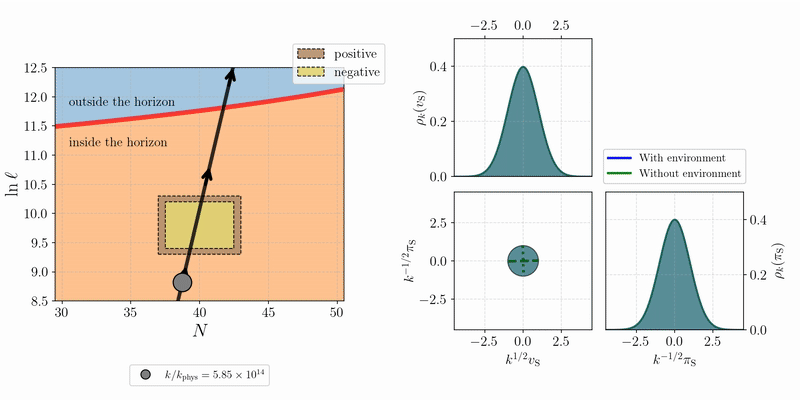

Repository under construction (11/24-11/28)

This repository contains the core code required to reproduce the results presented in the paper “Numerical Tiling-Based Simulations for Multifield Models of Inflation.” The routines are designed to be user-friendly and provide a guided tutorial that walks users through our results and enables further exploration of different configurations of decoherence events.

The code computes the two-point mode correlation functions (and other observables derived from them) for one and two-field models of inflation, but is easily scalable to theories with an arbitrarily large number of fields.

  

