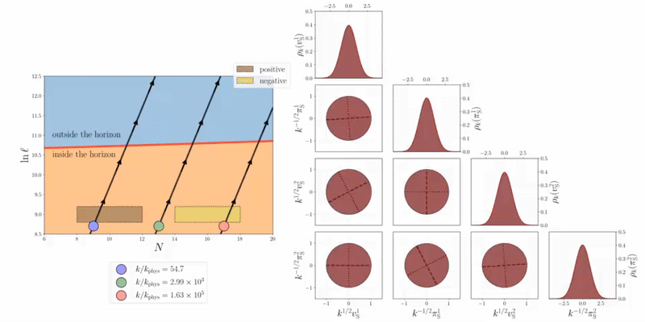

<h1 style="font-size: 60px; text-align: center;">
Numerical tiling-based simulations  
of decoherence in multifield models of inflation
</h1>

This repository contains the core code required to reproduce the results presented in the paper “Numerical Tiling-Based Simulations of Decoherence in Multifield Models of Inflation.” The routines are designed to be user-friendly and provide a guided tutorial that walks users through our results and enables further exploration of different configurations of decoherence events. 

  

The code computes the two-point mode correlation functions (and other observables derived from them) for one and two-field models of inflation, but is easily scalable to theories with an arbitrarily large number of fields.

  

<h3>Prerequisites</h3>

This project requires the following software:

1. Python environment:
   - Python&nbsp;3.9+
   - External Python packages:
     - NumPy
     - Matplotlib
     - Pillow

2. Fortran compiler

   A Fortran compiler is required to build and run the numerical simulations.

   You may use:
   - gfortran (GNU Fortran, recommended for portability)
   - ifx (Intel oneAPI Fortran compiler, recommended for performance)

3. screen for persistent terminal sessions

   Some long simulations rely on screen to keep processes running after closing the terminal.

<h3>Modules</h3>

1. styles_format.py:
   -
2. architecture.py:
   -
3. generate_fortran.py:
   -
4. run_fortran.py:
   -
5. load_data.py:
   -
6. configurations.py:
   -

